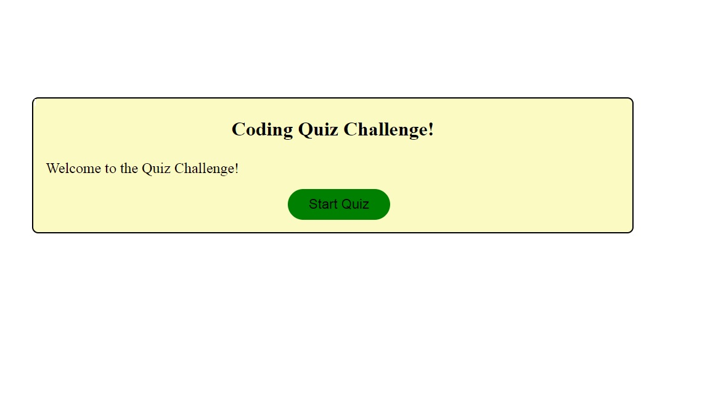

# Week4-hw
The homework assignment was to build a timed interactive coding quiz using JavaScript, HTML and CSS.  All acceptance criteria was tested and achieved.

https://drewml08.github.io/Week4-hw/
https://github.com/drewml08/Week4-hw

